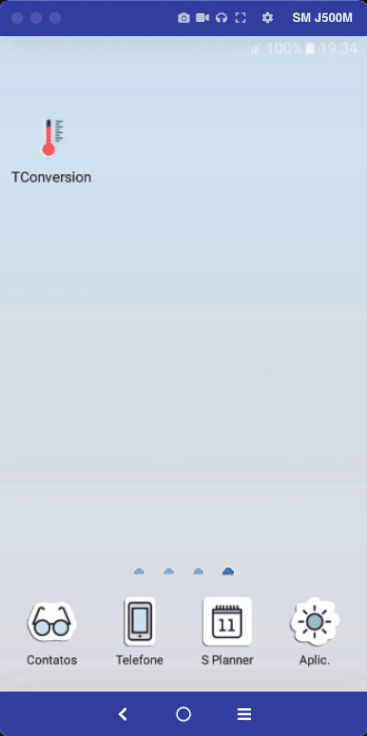

# Flutter temperature conversion

Segundo Eric Evans em seu livro <b>Domain-Driven Design: Atacando as Complexidades no Coração do Software</b>, OBJETOS DE VALOR são instanciados para representar elementos do design com os quais só nos preocupamos pelo <i>que</i> eles são, e não <i>quem</i> ou <i>quais</i> são.

Ou seja, uma das características do objetos de valor é garantir a representatividade e a consistência dos dados. Esse projeto tem como objetivo realizar a conversão de uma dada temperatura de acordo com a escala escolhida, sendo elas Celsius, Fahrenheit e Kelvin, através do uso de objetos de valor.

## Tecnologias/bibliotecas

Algumas das tecnologias/bibliotecas utilizadas na construção do aplicativo foram:

 - Flutter toolkit 3.3.1 (stable)
 - Dart 2.18.0
 - equatable: 2.0.5
 - fpdart: 0.2.0
 - provider: 6.0.3
 - uuid: 3.0.6 
 - dart_code_metrics 4.17.1
 - flutter_lints: 2.0.0
 - value_listenable_test: 0.0.1
 - flutter_launcher_icons: 0.10.0
 - flutter_native_splash: 2.2.8

Além dessas, há também outras bibliotecas. O pubspec.yaml possui a lista completa das bibliotecas utilizadas.

## Introdução

Dada uma unidade de medida, por exemplo, metro, e seu respectivo valor, ao realizar a troca dessa unidade para centímetro, automaticamente o seu valor deve ser convertido de acordo com a unidade correspondente.

Um caminho simples seria criar uma função, recebendo o valor original como argumento, aplicar o cálculo de conversão e retornar o novo valor.

Mas, o que fazer com esse valor? Talvez, para um script simples, rodando em linha de comando, onde a entrada é o valor original e a saída é o valor convertido, imprimi-lo no terminal já seria suficiente.

No entanto, em um sistema completo, com inúmeras responsabilidades, de preferência isoladas, torna-se necessário uma estratégia bem mais elaborada.

Dentre algumas estratégias, uma seria separar as responsabilidades em seus respectivos domínios e entidades, possibilitando resgatar seus dados em qualquer parte do sistema, seja na edição, em uma busca ou até mesmo como parte de um cálculo para obter um outro dado de interesse.

No entanto, como fazer para armazenar esse valor convertido em uma entidade? Simplesmente obtê-lo em uma função externa e atribuí-lo em seu respectivo atributo? Talvez não seja uma boa ideia. Primeiro porque poderia ferir o princípio de imutabilidade da entidade. Segundo porque essa conversão poderia simplesmente ser a regra de negócio da aplicação, como é o caso desse projeto.

Sendo a regra de negócio, não seria o caso da conversão ocorrer diretamente na entidade?

## O projeto

Como descrito no início desse texto, objetos de valor representam elementos pelo <i>que</i> eles são. No caso desse projeto, o elemento principal é o valor obtido de acordo com a sua escala escolhida, seja Celsius, Fahrenheit ou Kelvin.

O objeto de valor, então, teria como finalidade garantir a consistência e a representatividade do dado, estando de acordo com a escala escolhida.

Para que seja possível obter essa garantia, a função de conversão e a atribuição do dado convertido devem ser embutidos no respectivo objeto de valor.

É exatamente essa a proposta desse projeto.

### Conversão através de objeto de valor

Mas como fazer isso? Veja o código abaixo.

```dart
  import 'dart:math';

  import 'package:equatable/equatable.dart';

  import '../core/temperature_scale.dart';
  import 'temperature_value_objects.dart';

  class Temperature extends Equatable {
    final TemperatureIdValueObjects id;
    final TemperatureValueObjects value;
    final TemperatureScale scale;

    const Temperature({
      required this.id,
      required this.value,
      required this.scale,
    });

    @override
    List<Object> get props => [value, scale];

    factory Temperature.initial() => Temperature(
          id: TemperatureIdValueObjects(),
          value: TemperatureValueObjects(
            from: TemperatureScale.celsius,
            to: TemperatureScale.celsius,
            value: Random().nextBool()
                ? Random().nextInt(89).toDouble() * -1
                : Random().nextInt(57).toDouble(),
          ),
          scale: TemperatureScale.celsius,
        );
  }
```

Temos uma entidade chamada <b>Temperature</b>. Essa entidade possui um atributo chamado <b>value</b>, que, ao invés de ser do tipo double, ele é do tipo <b>TemperatureValueObjects</b>, o nosso objeto de valor. Veja o código de <b>TemperatureValueObjects</b>.

```dart
  import 'package:fpdart/fpdart.dart';
  import 'package:uuid/uuid.dart';

  import '../core/temperature_scale.dart';
  import '../core/value_objects.dart';
  import '../core/value_transformers.dart';

  class TemperatureValueObjects extends ValueObjects<double> {
    @override
    final Either<void, double> value;

    factory TemperatureValueObjects({
      required TemperatureScale from,
      required TemperatureScale to,
      required double value,
    }) =>
        TemperatureValueObjects._(
          convertTemperature(
            from: from,
            to: to,
            value: value,
          ),
        );

    TemperatureValueObjects._(this.value);
}
```

O objeto de valor <b>TemperatureValueObjects</b> possui o seu construtor privado, não podendo ser instanciado fora da própria classe. Em seu lugar, a instância externa é uma <b>factory</b>, responsável por receber a escala atual (<b>from</b>), a nova escala de interesse (<b>to</b>) e o valor a ser convertido.

Dentro dessa factory, é executada a função externa <b>convertTemperature</b>, responsável por aplicar o cálculo de conversão, de acordo com a escala atual, a nova escala escolhida e o valor atual, retornando o novo valor convertido. 

Esse valor convertido é armazenado no próprio objeto de valor <b>TemperatureValueObjects</b>, através de seu construtor privado, estando assim disponível no atributo <b>value</b>, da entidade <b>Temperature</b>.

Sempre que ocorre a troca de uma escala, uma nova instância de <b>Temperature</b> é gerada, já com o novo valor convertido, devido ao seu objeto de valor <b>TemperatureValueObjects</b>.

## Exemplos

<table>
  <tr>
    <td>
      <p align="center">
        
      </p>
      <p align="center">
        iPhone 7
      </p>
    </td>
    <td>
      <p align="center">
        
      </p>
      <p align="center">
        iPhone 5
      </p>
    </td>
    <td>
      <p align="center">
        
      </p>
      <p align="center">
        Samsung Galaxy J5
      </p>
    </td>
  </tr>
</table>

Ao abrir o aplicativo, é gerado um valor aleatório, na escala Celsius, variando de -89 a 57 graus. Essa variação baseia-se nessa matéria sobre a [temperatura mais fria já registrada na Terra](https://www.terra.com.br/noticias/educacao/voce-sabia-qual-foi-a-temperatura-mais-fria-ja-registrada-na-terra,9a09a8e308923213fbf5e93bd050ac64j7iuRCRD.html) e sobre essa matéria sobre a [temperatura mais quente já registrada na Terra](https://www.tempo.com/noticias/actualidade/ha-108-anos-obteve-se-a-temperatura-mais-alta-ja-medida-no-historico-vale-da-morte-california.html).

Após essa inicialização, o aplicativo está pronto para aplicar as conversões disponíveis, como Celsius para Fahrenheit, Celsius para Kelvin, Fahrenheit para Kelvin e etc...

## Considerações

### Complexidade

Analisando a aplicação em si, talvez alguém possa pensar que há uma complexidade maior do que o necessário. No entanto, o intuito desse repositório não é a aplicação, mas o uso de objetos de valor para a conversão e armazenamento do valor convertido, de acordo com a troca de uma escala para outra.

Em um outro contexto, onde o enfoque de fato seja a aplicação, depois de análises e debates entre a equipe de desenvolvimento, o caminho para a construção de um software com características similares seja completamente o oposto.

### Inserir manualmente um valor a ser convertido

O valor da temperatura é gerado automaticamente ao abrir o aplicativo. Para obter um outro valor, é necessário fechar e abrir o aplicativo novamente.

Talvez em um futuro próximo, um botão para gerar um novo valor aleatório possa ser implementado. Até mesmo inserir um valor manualmente, possibilitando enriquecer o objeto de valor <b>TemperatureValueObjects</b> com sua validação.

## Imagem do ícone do aplicativo

<div>Icons made by <a href="https://www.freepik.com" title="Freepik">Freepik</a> from <a href="https://www.flaticon.com/" title="Flaticon">www.flaticon.com</a></div>